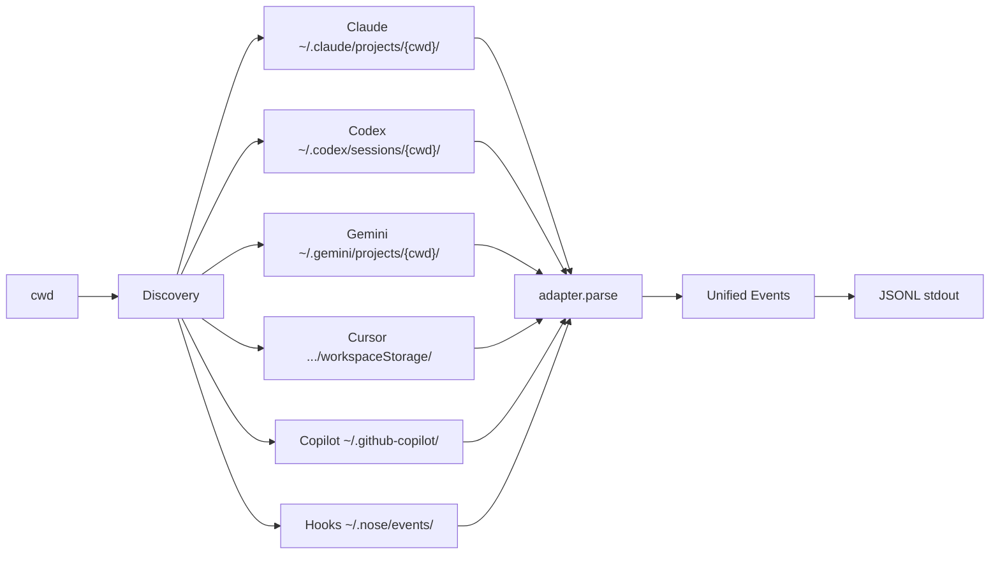
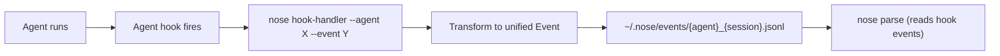

# Nose

Unified event format for AI coding agent actions. Nose auto-discovers agent sessions on your machine, parses their logs, and emits a consistent JSONL event stream.

**Lang:** Rust | **Output:** JSONL | **Platform:** macOS, Linux, Windows

## Installation

```bash
cargo install --path .
```

Or build locally:

```bash
cargo build --release
# binary at target/release/nose
```

## Usage

Run from within any project directory where you've used an AI coding agent:

```bash
cd my-project/
nose parse
```

Nose scopes to the **current working directory**. It only parses sessions from the project you're in.

Output goes to stdout as JSONL (one JSON event per line):

```bash
# All events
nose parse > events.jsonl

# Only new events since last run (uses ~/.nose/offsets.json bookmark)
nose parse --new

# Count events
nose parse | wc -l

# Filter for tool calls only
nose parse | jq 'select(.event_type == "ToolCall")'

# See what files the agent touched
nose parse | jq 'select(.event_type == "FileWrite") | .path'

# Get all shell commands the agent ran
nose parse | jq 'select(.event_type == "CommandExec") | .command'

# Count events by type
nose parse | jq -r '.event_type' | sort | uniq -c | sort -rn
```

### Stats

```bash
nose stats
```

Shows a summary: sessions, events by type, token usage, models used, top tools, files touched.

### Watch (real-time streaming)

```bash
nose watch
```

Streams events to stdout as they happen. Watches agent log files and `~/.nose/events/` for changes.

### Hooks (real-time capture)

Install hooks into all detected agents:

```bash
nose hooks install
```

This configures Claude Code, Codex CLI, and Gemini CLI to emit events in real-time to `~/.nose/events/`. Events are captured as they happen, with `confidence: native`.

Remove hooks:

```bash
nose hooks uninstall
```

Hooks are non-destructive - they append to existing agent hook configs and only remove nose-managed entries on uninstall.

## Supported Agents

| Agent | Log parsing | Real-time hooks |
|---|---|---|
| Claude Code | JSONL transcripts | PreToolUse, PostToolUse, SessionStart, SessionEnd |
| Codex CLI | JSON log files | SessionStart, SessionStop |
| Gemini CLI | Stream-JSON output | BeforeTool, AfterTool, SessionStart, SessionEnd |
| Cursor | Hook output files | planned |
| GitHub Copilot | Hook output files | planned |

## Event Model

All events share common fields:

| Field | Type | Description |
|---|---|---|
| `event_id` | UUID | Unique event identifier |
| `session_id` | string | Agent session identifier |
| `timestamp` | ISO 8601 | When the event occurred |
| `agent_type` | enum | `claude`, `codex`, `gemini`, `cursor`, `copilot` |
| `workspace` | string | Working directory path |
| `confidence` | enum | `native`, `inferred` |
| `raw_payload` | object? | Original agent-specific payload (optional) |

## Event Types

| Event | Description |
|---|---|
| SessionStart | Agent started a session |
| SessionEnd | Agent ended a session |
| ModelRequest | Prompt sent to LLM |
| ModelResponse | Response received from LLM |
| ToolCall | Agent invoked a tool |
| ToolResult | Tool returned a result |
| FileRead | File read operation |
| FileWrite | File write/create operation |
| FileDelete | File delete operation |
| CommandExec | Shell command execution |
| SubagentStart | Sub-agent spawned |
| SubagentEnd | Sub-agent finished |
| NetworkCall | HTTP/API call |
| McpCall | MCP server call |
| Artifact | Agent produced an artifact |
| Error | Error in agent session |

## Log Parsing Support Matrix

What events `nose parse` can extract from each agent's native log files.

✅ direct  ⚠️ derived from other data  ❌ agent doesn't expose this  🔲 planned

| Event | Claude Code | Codex CLI | Gemini CLI | Cursor | Copilot |
|---|---|---|---|---|---|
| SessionStart | ⚠️ | ⚠️ | ⚠️ | ⚠️ | ✅ |
| SessionEnd | ⚠️ | ⚠️ | ⚠️ | ✅ | ✅ |
| ModelRequest | ✅ | ✅ | ✅ | ❌ | ❌ |
| ModelResponse | ✅ | ✅ | ✅ | ❌ | ❌ |
| ToolCall | ✅ | ✅ | ✅ | ❌ | ✅ |
| ToolResult | ✅ | ✅ | ✅ | ❌ | ✅ |
| FileRead | ⚠️ | ⚠️ | ⚠️ | ✅ | ⚠️ |
| FileWrite | ⚠️ | ⚠️ | ⚠️ | ✅ | ⚠️ |
| FileDelete | ⚠️ | ⚠️ | ⚠️ | ❌ | ⚠️ |
| CommandExec | ⚠️ | ⚠️ | ⚠️ | ✅ | ⚠️ |
| SubagentStart | ⚠️ | ❌ | ❌ | ❌ | ❌ |
| SubagentEnd | ❌ | ❌ | ❌ | ❌ | ❌ |
| NetworkCall | ⚠️ | ❌ | ⚠️ | ❌ | ❌ |
| McpCall | ⚠️ | ❌ | ❌ | ✅ | ❌ |
| Artifact | ❌ | ❌ | ❌ | ❌ | ❌ |
| Error | ❌ | ❌ | ✅ | ❌ | ✅ |

## Hook Support Matrix

What events `nose hooks install` captures in real-time from each agent.

✅ direct  ⚠️ derived from other hook events  ❌ agent doesn't expose this  🔲 planned

| Event | Claude Code | Codex CLI | Gemini CLI | Cursor | Copilot |
|---|---|---|---|---|---|
| SessionStart | ✅ | ✅ | ✅ | ❌ | ✅ |
| SessionEnd | ✅ | ✅ | ✅ | ✅ | ✅ |
| ToolCall | ✅ | ❌ | ✅ | ❌ | ✅ |
| ToolResult | ✅ | ❌ | ✅ | ❌ | ✅ |
| FileRead | ⚠️ | ❌ | ⚠️ | ✅ | ⚠️ |
| FileWrite | ⚠️ | ❌ | ⚠️ | ✅ | ⚠️ |
| CommandExec | ⚠️ | ❌ | ⚠️ | ✅ | ⚠️ |
| McpCall | ⚠️ | ❌ | ❌ | ✅ | ❌ |
| SubagentStart | ⚠️ | ❌ | ❌ | ❌ | ❌ |
| Error | ❌ | ❌ | ❌ | ❌ | ✅ |

## Architecture

### Log parsing (`nose parse`)



### Real-time hooks (`nose hooks install`)


